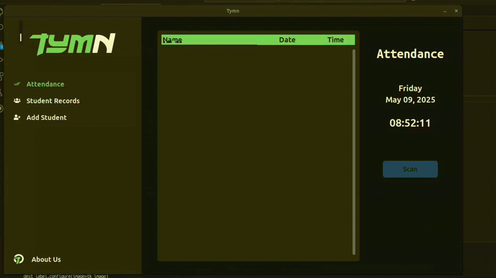
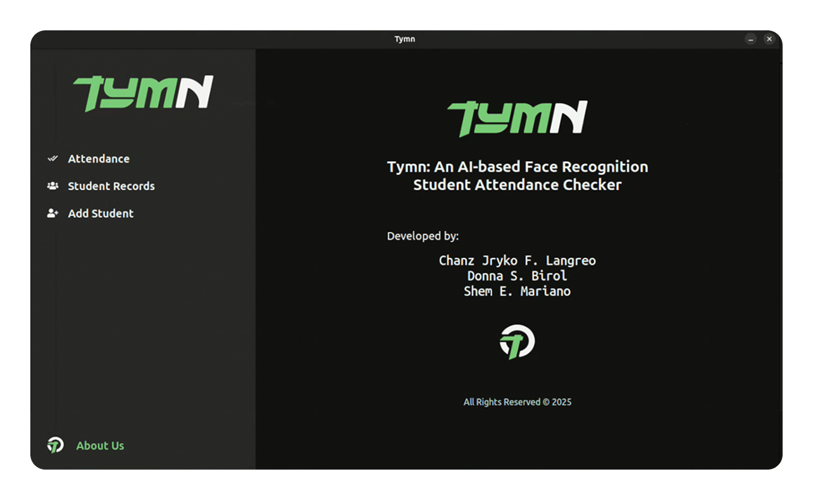
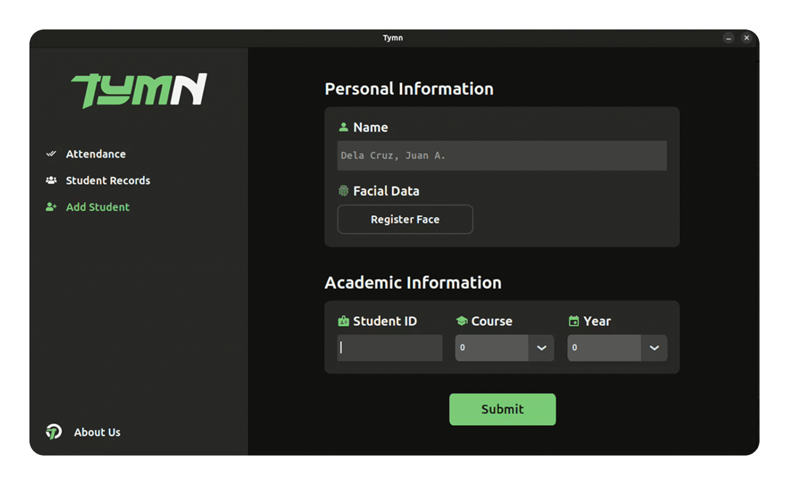
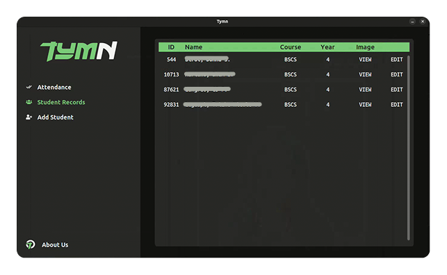
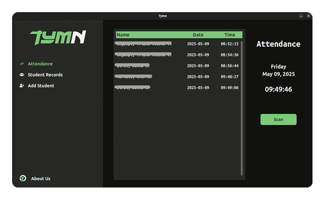
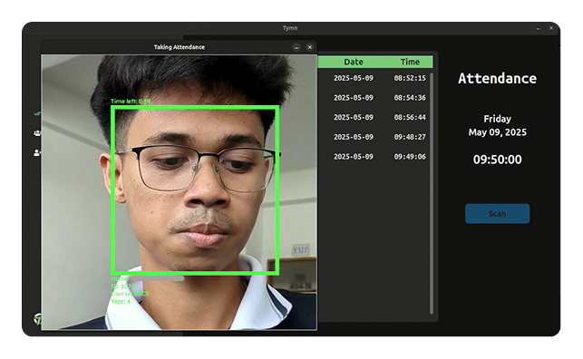
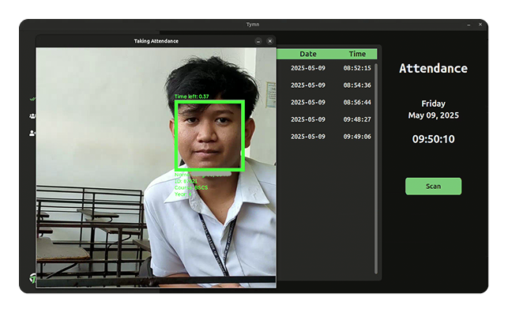

# TYMN, A Facial Recognition Student Attendance Checker

## Introduction

Developed as a school project. Tymn uses a pre-trained AI to recognize students' faces recorded in a database to take their attendance if previous records are found, if not, uses their facial data to register them as a new student. Also has the ability to use your Android phone's camera for the facial recognition.

## Development

- This project was developed using
  [Python](https://www.python.org),
  [SQLite](https://www.sqlite.org/),
  [Pillow](https://pypi.org/project/pillow/),
  and [CustomTkinter](https://customtkinter.tomschimansky.com/).

- [Scrcpy](https://github.com/Genymobile/scrcpy) was also used to create a custom script that allows users to use their Android phone as a camera to use with the application.

## Face Recognition

TYMN uses [Adam Geitgey's face_recognition API](https://github.com/ageitgey/face_recognition) under the hood for its face recognition feature.
- Adding new student to the database
- Attendance check by facial recognition

  
  

## User Interface

Interface developed with CustomTkinter library.

  
  

  
  

  
  

